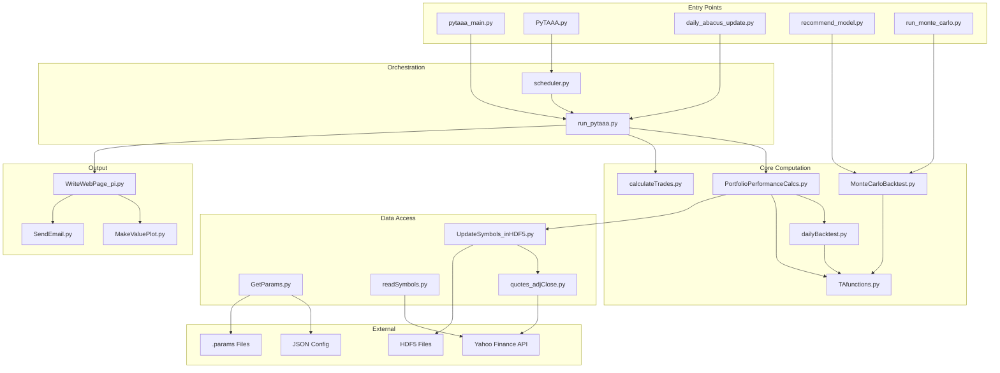
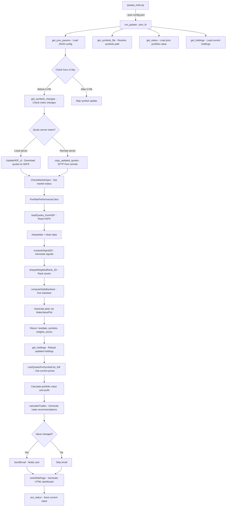
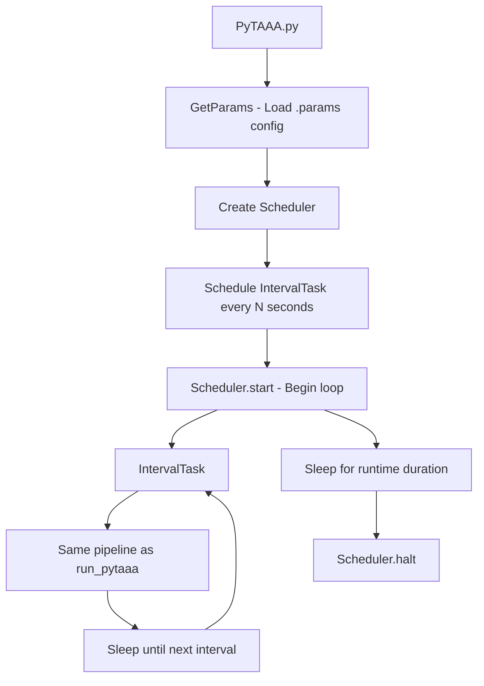
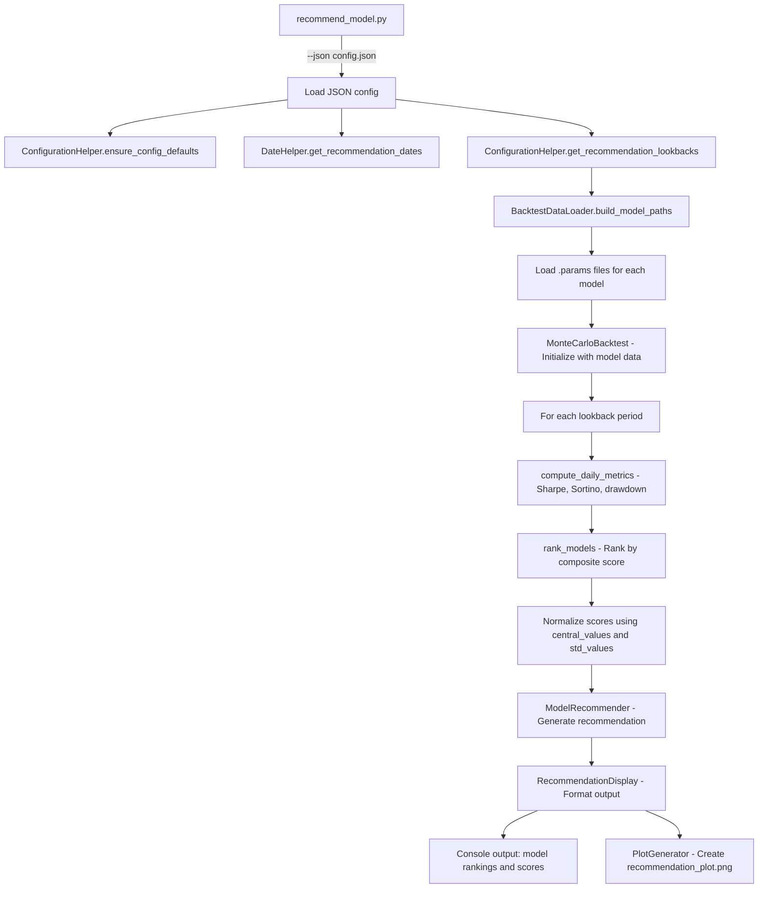
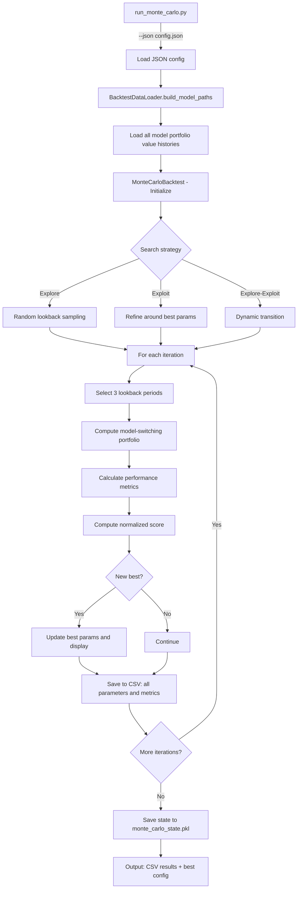
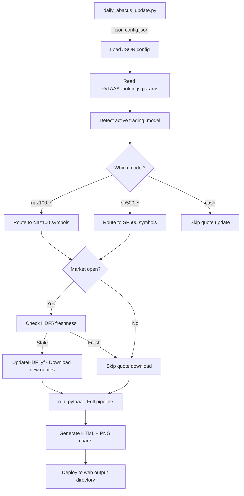
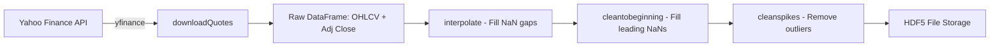
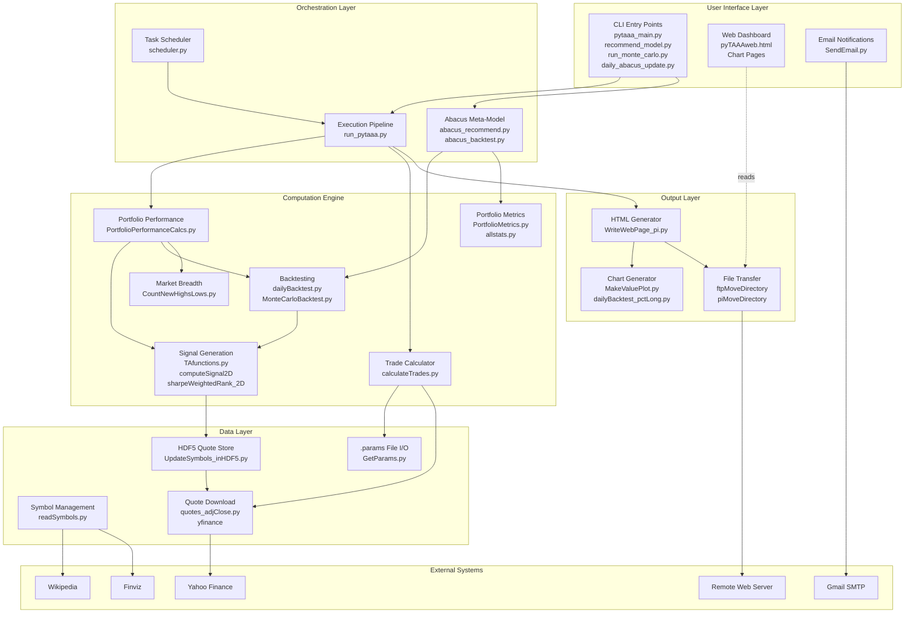
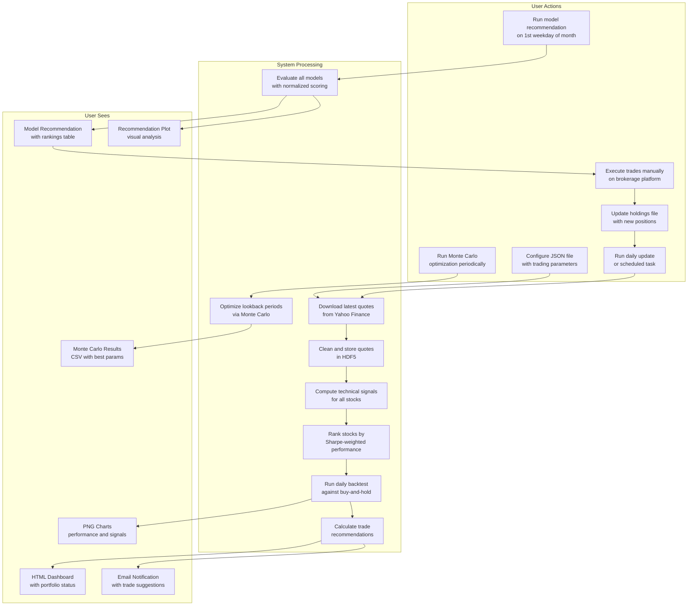
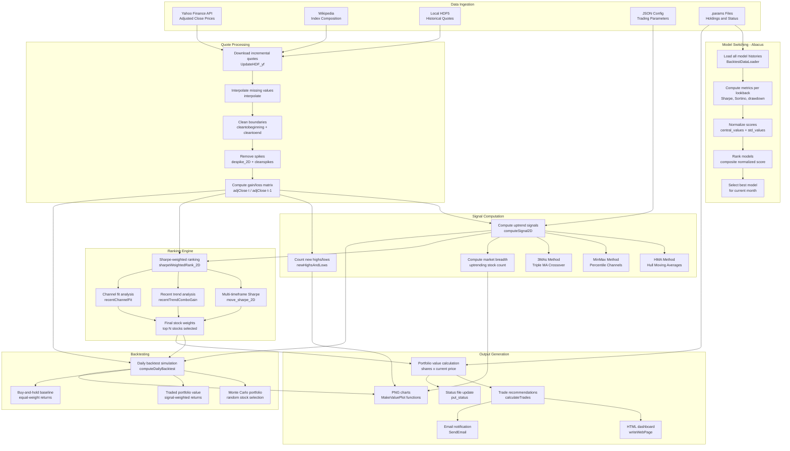

# PyTAAA Architecture

**Last Updated:** February 9, 2026

---

## 1. Codebase Architectural Layout

### Directory Structure

```
PyTAAA/
├── pytaaa_main.py              # Modern CLI entry point
├── PyTAAA.py                   # Legacy scheduler-based entry point
├── run_pytaaa.py               # Core execution pipeline
├── daily_abacus_update.py      # Daily portfolio tracking
├── recommend_model.py          # Model recommendation engine
├── run_monte_carlo.py          # Monte Carlo parameter optimizer
├── run_normalized_score_history.py  # Score history analysis
├── update_json_from_csv.py     # Config update utility
├── modify_saved_state.py       # State management utility
├── compute_allocations.py      # Allocation computation
├── compute_new_allocations.py  # Alternative allocation computation
├── pytaaa_quotes_update.py     # Quote data cleaning
├── re-generateHDF5.py          # Legacy HDF5 regeneration
├── scheduler.py                # Custom task scheduler
├── pytaaa_generic.json         # Template JSON configuration
├── pytaaa_model_switching_params.json  # Abacus model config
├── pyproject.toml              # Project metadata and dependencies
├── requirements.txt            # Pip requirements
├── functions/                  # Core library modules
│   ├── TAfunctions.py          # Technical analysis functions - 4100+ lines
│   ├── PortfolioPerformanceCalcs.py  # Portfolio ranking pipeline
│   ├── MonteCarloBacktest.py   # Monte Carlo simulation engine
│   ├── dailyBacktest.py        # Daily backtesting logic
│   ├── dailyBacktest_pctLong.py  # Backtest visualization
│   ├── calculateTrades.py      # Trade recommendation logic
│   ├── UpdateSymbols_inHDF5.py # HDF5 quote management
│   ├── WriteWebPage_pi.py      # HTML generation and deployment
│   ├── MakeValuePlot.py        # Chart generation
│   ├── GetParams.py            # Configuration loading
│   ├── readSymbols.py          # Symbol list management
│   ├── quotes_adjClose.py      # Quote downloading
│   ├── quotes_for_list_adjClose.py  # Batch quote operations
│   ├── abacus_recommend.py     # Recommendation engine classes
│   ├── abacus_backtest.py      # Backtest data management
│   ├── PortfolioMetrics.py     # Performance metric calculations
│   ├── allstats.py             # Statistical functions
│   ├── CountNewHighsLows.py    # Market breadth indicators
│   ├── stock_cluster.py        # Stock clustering
│   ├── CheckMarketOpen.py      # Market status detection
│   ├── SendEmail.py            # Email notifications
│   ├── clean_quote_data.py     # Quote data cleaning
│   ├── ftp_quotes.py           # Remote quote file transfer
│   ├── GetYieldCurve.py        # Treasury yield curve data
│   ├── logger_config.py        # Centralized logging
│   └── yahooFinance.py         # Yahoo Finance API wrapper
├── docs/                       # Documentation
├── tests/                      # Test suite
├── scripts/                    # Utility scripts
├── log_files/                  # Log output
├── pyTAAA_data/                # Local data files
└── .github/                    # GitHub metadata and plans
```

### Architectural Layers

The codebase follows a loosely layered architecture, though boundaries are not strictly enforced:



---

## 2. Data Flow in pytaaa_main.py and Other Entry Points

### 2.1 pytaaa_main.py / run_pytaaa.py Data Flow

This is the primary execution pipeline. The data flows through these stages:



### 2.2 PyTAAA.py Data Flow

The legacy entry point wraps the same logic in a scheduler loop:



**Key difference:** [`PyTAAA.py`](../PyTAAA.py:1) uses legacy [`GetParams()`](../functions/GetParams.py:551) reading from `.params` files, while [`run_pytaaa.py`](../run_pytaaa.py:32) uses [`get_json_params()`](../functions/GetParams.py:219) reading from JSON.

### 2.3 recommend_model.py Data Flow



### 2.4 run_monte_carlo.py Data Flow



### 2.5 daily_abacus_update.py Data Flow



---

## 3. Data: Sources, Gathering, and Storage

### 3.1 Data Sources

| Data Type | Source | Method | Frequency |
|---|---|---|---|
| **Stock Quotes** | Yahoo Finance | `yfinance` Python package | Daily (after market close) |
| **Index Composition** | Wikipedia | Web scraping via `pandas.read_html()` | Daily check |
| **Market Status** | Yahoo Finance / NASDAQ | HTTP scraping | Each run cycle |
| **Sector/Industry** | Finviz | `finvizfinance` package | On demand |
| **Treasury Yields** | US Treasury | XML feed (legacy, non-functional) | Not currently active |
| **Configuration** | Local JSON files | File I/O | Manual updates |
| **Holdings** | Local `.params` files | File I/O | Manual updates after trades |

### 3.2 Data Gathering Process

#### Stock Quote Download Pipeline



The quote download is managed by [`UpdateHDF_yf()`](../functions/UpdateSymbols_inHDF5.py:679):
1. Reads the current HDF5 file to determine the last stored date
2. Downloads only new data from Yahoo Finance (incremental update)
3. Cleans the data (interpolation, spike removal, boundary filling)
4. Appends to the existing HDF5 store
5. Handles stock splits and adjusted close prices automatically via `yfinance`

#### Symbol List Management

Symbol lists are maintained in two ways:
1. **Local text files** (e.g., `Naz100_Symbols.txt`, `SP500_Symbols.txt`) — authoritative list
2. **Web scraping** from Wikipedia — used to detect additions/removals from the index

[`get_symbols_changes()`](../functions/readSymbols.py:724) compares the local list against the web-scraped list and reports added/removed tickers. The local file is updated to reflect changes.

### 3.3 Data Storage

#### HDF5 Files (Primary Quote Storage)

| File Pattern | Contents | Location |
|---|---|---|
| `Naz100_Symbols_.hdf5` | Nasdaq 100 adjusted close prices, all dates | `symbols/` directory under data store |
| `SP500_Symbols_.hdf5` | S&P 500 adjusted close prices, all dates | `symbols/` directory under data store |

**Structure:** Each HDF5 file contains a pandas DataFrame with:
- **Index:** Date strings (YYYY-MM-DD)
- **Columns:** Stock ticker symbols
- **Values:** Adjusted close prices (float)

Data is loaded via [`loadQuotes_fromHDF()`](../functions/UpdateSymbols_inHDF5.py:39) which returns:
- `adjClose` — 2D numpy array [symbols × dates]
- `symbols` — List of ticker strings
- `datearray` — Array of datetime objects
- Volume and other arrays (when available)

#### .params Files (State and Configuration)

| File | Format | Contents |
|---|---|---|
| `PyTAAA_status.params` | `cumu_value: YYYY-MM-DD HH:MM:SS.ffffff value signal traded_value` | Daily portfolio value history |
| `PyTAAA_holdings.params` | Key-value pairs | Current stocks, shares, buy prices, ranks, cumulative cash in, trading model |
| `PyTAAA_ranks.params` | Space-separated | Current stock rankings |
| `pyTAAAweb_backtestPortfolioValue.params` | Space-separated columns | Backtest results: date, buy-hold value, traded value, new highs, new lows, selected model |

#### JSON Configuration Files

| File | Purpose |
|---|---|
| `pytaaa_generic.json` | Template with all configuration sections |
| `pytaaa_model_switching_params.json` | Abacus model-switching parameters |
| `abacus_combined_PyTAAA_*.json` | Combined status for multi-model tracking |

#### Pickle Files

| File | Purpose |
|---|---|
| `monte_carlo_state.pkl` | Saved Monte Carlo optimization state for resume capability |

#### CSV/Excel Output

| File | Purpose |
|---|---|
| `monte_carlo_results.csv` | Full Monte Carlo iteration results |
| `abacus_best_performers.csv` | Top-performing parameter configurations |

### 3.4 Data Directory Layout

The primary data store is located at `/Users/donaldpg/pyTAAA_data/` with this structure:

```
pyTAAA_data/
├── naz100_pine/
│   ├── symbols/
│   │   ├── Naz100_Symbols.txt
│   │   └── Naz100_Symbols_.hdf5
│   └── data_store/
│       ├── PyTAAA_status.params
│       ├── PyTAAA_holdings.params
│       ├── PyTAAA_ranks.params
│       └── pyTAAAweb_backtestPortfolioValue.params
├── naz100_hma/
│   └── ... same structure ...
├── naz100_pi/
│   └── ... same structure ...
├── sp500_hma/
│   ├── symbols/
│   │   ├── SP500_Symbols.txt
│   │   └── SP500_Symbols_.hdf5
│   └── data_store/
│       └── ... same structure ...
├── sp500_pine/
│   └── ... same structure ...
└── naz100_sp500_abacus/
    └── data_store/
        ├── PyTAAA_status.params
        ├── PyTAAA_holdings.params
        └── pyTAAAweb_backtestPortfolioValue.params
```

---

## 4. Block Diagrams

### 4.1 Major Components Block Diagram



### 4.2 User Perspective Data Flow

This diagram shows the data flow from a user's perspective — what they do, what happens, and what they see:



### 4.3 Backend Computation Data Flow

This diagram shows the internal data transformations from raw market data to final outputs:



---

## 5. Key Architectural Patterns

### 5.1 Dual Configuration System

The codebase maintains two parallel configuration systems:

1. **Legacy `.params` files** — Used by [`PyTAAA.py`](../PyTAAA.py:1) and the original `GetParams()`, `GetHoldings()`, `GetStatus()`, `PutStatus()` functions
2. **Modern JSON files** — Used by [`pytaaa_main.py`](../pytaaa_main.py:1) and the newer `get_json_params()`, `get_holdings()`, `get_status()`, `put_status()` functions

Both systems coexist in [`GetParams.py`](../functions/GetParams.py:1), with the JSON-based functions accepting a `json_fn` parameter. This dual system exists because the codebase evolved from `.params` files to JSON without fully deprecating the legacy approach.

**Evidence:** [`GetParams.py`](../functions/GetParams.py:1) contains both [`GetParams()`](../functions/GetParams.py:551) (legacy, no arguments) and [`get_json_params()`](../functions/GetParams.py:219) (modern, takes `json_fn`). Similarly, [`GetHoldings()`](../functions/GetParams.py:694) vs [`get_holdings()`](../functions/GetParams.py:170).

### 5.2 Function-Based Architecture

The codebase is primarily organized around functions rather than classes. The few classes that exist are:

| Class | Module | Purpose |
|---|---|---|
| `allstats` | [`allstats.py`](../functions/allstats.py:4) | Statistical calculations on price arrays |
| `MonteCarloBacktest` | [`MonteCarloBacktest.py`](../functions/MonteCarloBacktest.py:1) | Monte Carlo simulation engine |
| `BacktestDataLoader` | [`abacus_backtest.py`](../functions/abacus_backtest.py:20) | Backtest data loading |
| `ConfigurationHelper` | [`abacus_recommend.py`](../functions/abacus_recommend.py:25) | Configuration management |
| `DateHelper` | [`abacus_recommend.py`](../functions/abacus_recommend.py:1) | Date calculations |
| `ModelRecommender` | [`abacus_recommend.py`](../functions/abacus_recommend.py:1) | Recommendation generation |
| `RecommendationDisplay` | [`abacus_recommend.py`](../functions/abacus_recommend.py:1) | Output formatting |
| `PlotGenerator` | [`abacus_recommend.py`](../functions/abacus_recommend.py:1) | Plot generation |
| `AllocationComputer` | [`compute_allocations.py`](../compute_allocations.py:36) | Allocation computation |
| `Task`, `Scheduler` | [`scheduler.py`](../scheduler.py:4) | Task scheduling |
| `PerformanceMetrics` | [`MonteCarloBacktest.py`](../functions/MonteCarloBacktest.py:50) | Named tuple for metrics |

The newer Abacus-related modules (`abacus_recommend.py`, `abacus_backtest.py`) use a more object-oriented design, reflecting a deliberate refactoring effort documented in [`.github/RECOMMEND_MODEL_REFACTORING_PLAN.md`](../.github/RECOMMEND_MODEL_REFACTORING_PLAN.md:1).

### 5.3 Data Flow Coupling

Functions communicate primarily through:
1. **Numpy arrays** — The dominant data structure. `adjClose` (2D: symbols × dates), `signal2D`, `gainloss` arrays flow through the computation pipeline.
2. **File I/O** — `.params` files serve as both persistent storage and inter-process communication.
3. **Function return values** — Tuples of arrays and lists (e.g., `PortfolioPerformanceCalcs` returns `lastdate, symbols, weights, prices`).
4. **Global state** — Some functions use `os.chdir()` to set working directory, and the legacy `PyTAAA.py` uses module-level variables.

---

## 6. References

1. **HDF5 Format:** The HDF Group. "Hierarchical Data Format, version 5." https://www.hdfgroup.org/solutions/hdf5/. Used via PyTables (`tables` package) for efficient storage of large numerical arrays.

2. **yfinance:** Ran Aroussi. "yfinance - Yahoo! Finance market data downloader." https://github.com/ranaroussi/yfinance. Primary data source for stock quotes.

3. **Click CLI Framework:** Pallets Projects. "Click - Python composable command line interface toolkit." https://click.palletsprojects.com/. Used in modern entry points for argument parsing.

4. **FastAPI:** Sebastián Ramírez. "FastAPI - modern, fast web framework for building APIs." https://fastapi.tiangolo.com/. Used in the complementary `pytaaa_web` codebase.

5. **Numba JIT:** Numba Development Team. "Numba: A High Performance Python Compiler." https://numba.pydata.org/. Used in [`MonteCarloBacktest.py`](../functions/MonteCarloBacktest.py:58) for performance-critical numerical computations.

6. **pandas-market-calendars:** Used in [`readSymbols.py`](../functions/readSymbols.py:9) for determining trading days and market holidays.

7. **Paramiko:** Used in [`WriteWebPage_pi.py`](../functions/WriteWebPage_pi.py:19) and [`ftp_quotes.py`](../functions/ftp_quotes.py:1) for SFTP file transfers.

8. **Hull Moving Average:** Hull, A. (2005). The HMA reduces lag compared to traditional SMAs by using weighted moving averages of different periods. Implementation in [`hma()`](../functions/TAfunctions.py:1252).

9. **Sharpe Ratio:** Sharpe, W.F. (1994). "The Sharpe Ratio." *Journal of Portfolio Management*, 21(1), 49-58. The annualized version used throughout PyTAAA follows the standard formula: `(geometric_mean_return^252 - 1) / (std_dev * sqrt(252))`.

10. **Monte Carlo Methods in Finance:** Glasserman, P. (2003). *Monte Carlo Methods in Financial Engineering*. Springer. The explore-exploit search strategy in [`run_monte_carlo.py`](../run_monte_carlo.py:1) adapts concepts from this domain.
