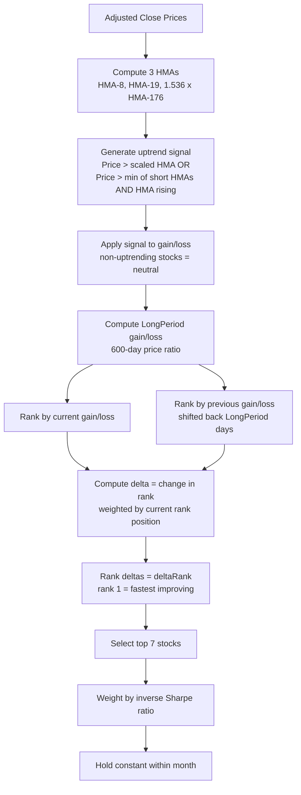

# HMAs Method — Naz100_hma and SP500_hma Trading Models

**Last Updated:** February 9, 2026

---

## 1. Overview

The **HMAs** (Hull Moving Averages) method is the signal generation strategy used by the **naz100_hma** and **sp500_hma** trading models. It determines whether each stock is in an uptrend by comparing the adjusted closing price against three Hull Moving Averages of different periods. The HMA is designed to reduce the lag inherent in traditional Simple Moving Averages while maintaining smoothness.

- **Model names:** `naz100_hma` (Nasdaq 100), `sp500_hma` (S&P 500)
- **Stock universes:** Nasdaq 100 or S&P 500 respectively
- **Signal method identifier:** `uptrendSignalMethod = 'HMAs'`
- **Implementation:** [`computeSignal2D()`](../functions/TAfunctions.py:1536) in `TAfunctions.py`, lines 1536–1560

---

## 2. The Hull Moving Average (HMA)

### 2.1 What Makes HMA Different from SMA

The Hull Moving Average, developed by Alan Hull in 2005, addresses the fundamental trade-off in moving averages: longer periods provide smoother signals but introduce more lag. The HMA uses weighted moving averages and a square-root smoothing step to achieve both low lag and high smoothness.

**Comparison:**
| Property | SMA | HMA |
|---|---|---|
| Lag | High (proportional to period) | Low (proportional to √period) |
| Smoothness | Moderate | High |
| Responsiveness | Slow | Fast |
| Overshoot | Minimal | Can overshoot on sharp reversals |

### 2.2 HMA Computation

The [`hma()`](../functions/TAfunctions.py:1252) function implements the Hull Moving Average:

```python
def hma(x, period):
    # Step 1: Compute WMA of half-period
    wma_1 = x.rolling(period // 2).apply(
        lambda x: sum(x * range(1, len(x)+1)) / sum(range(1, len(x)+1))
    )
    
    # Step 2: Compute WMA of full period
    wma_2 = x.rolling(period).apply(
        lambda x: sum(x * range(1, len(x)+1)) / sum(range(1, len(x)+1))
    )
    
    # Step 3: Compute difference series
    diff = 2 * wma_1 - wma_2
    
    # Step 4: Smooth with SMA of sqrt(period)
    hma = diff.rolling(int(sqrt(period))).mean()
    
    return hma
```

**The four steps:**

1. **Half-period WMA:** Compute a Weighted Moving Average over `period/2` days. Recent prices get higher weights (linearly increasing: 1, 2, 3, ..., N).

2. **Full-period WMA:** Compute a WMA over the full `period` days.

3. **Difference series:** `diff = 2 × WMA(period/2) - WMA(period)`. This extrapolates the half-period trend forward, effectively removing most of the lag.

4. **Final smoothing:** Apply a simple moving average of period `√period` to the difference series. This removes noise without reintroducing significant lag.

### 2.3 Mathematical Formulation

For a price series P and period N:

```
WMA(P, N) = Σᵢ₌₁ᴺ (i × Pₜ₋ₙ₊ᵢ) / Σᵢ₌₁ᴺ i

HMA_raw(P, N) = 2 × WMA(P, N/2) - WMA(P, N)

HMA(P, N) = SMA(HMA_raw, √N)
```

The key insight is that `2 × WMA(N/2) - WMA(N)` creates a series that leads the price — it anticipates where the price is heading based on the difference between short-term and long-term weighted trends.

---

## 3. Signal Generation: Three HMAs

### 3.1 The Three Hull Moving Averages

The method computes three HMAs from the adjusted closing price array:

| MA | Variable | Formula | Typical Value | Role |
|---|---|---|---|---|
| **HMA₀** | `sma0` | `hma(adjClose, MA2)` | MA2 = 8 days | Short-term trend |
| **HMA₁** | `sma1` | `hma(adjClose, MA2 + MA2offset)` | 8 + 11 = 19 days | Medium-term trend |
| **HMA₂** | `sma2` | `sma2factor × hma(adjClose, MA1)` | 1.536 × HMA(176 days) | Long-term scaled envelope |

> **Note:** The code uses variable names `sma0`, `sma1`, `sma2` even though these are HMAs, not SMAs. This is because the HMA method was added later using the same variable structure as the SMAs method.

### 3.2 Uptrend Signal Logic

The signal logic is **identical** to the SMAs method — only the moving average computation differs:

A stock is classified as **uptrending** (signal = 1) on day `j` if **either** condition is true:

1. **Price above scaled long-term HMA:** `adjClose[stock, j] > sma2[stock, j]`
2. **Price above short-term HMAs AND short HMA rising:** `adjClose[stock, j] > min(sma0[stock, j], sma1[stock, j])` **AND** `sma0[stock, j] > sma0[stock, j-1]`

**Implementation** (from [`TAfunctions.py`](../functions/TAfunctions.py:1548)):
```python
if adjClose[ii,jj] > sma2[ii,jj] or \
   ((adjClose[ii,jj] > min(sma0[ii,jj], sma1[ii,jj]) and \
     sma0[ii,jj] > sma0[ii,jj-1])):
    signal2D[ii,jj] = 1
```

### 3.3 How HMA Changes the Signal Behavior

Because HMA has less lag than SMA:

- **Earlier entry:** The HMA crosses above/below price sooner, generating uptrend signals earlier in a trend
- **Earlier exit:** Downtrend signals also arrive sooner, potentially avoiding more of a decline
- **More whipsaws:** The reduced lag means the HMA is more sensitive to short-term price movements, which can generate false signals in choppy markets
- **Overshoot risk:** The extrapolation step (2×WMA(N/2) - WMA(N)) can cause the HMA to overshoot during sharp reversals

### 3.4 Signal Comparison: HMA vs SMA

```
Price:  ──────╱╲──────────╱──────────╲──────
             ╱  ╲        ╱            ╲
            ╱    ╲      ╱              ╲
           ╱      ╲    ╱                ╲
          ╱        ╲──╱                  ╲──

HMA(8):  ─────╱╲──────────╱──────────╲──────
          [responds quickly, slight overshoot at peaks]

SMA(8):  ──────╱╲─────────╱──────────╲──────
          [smoother but delayed response]

HMA signal: 0000111111111110000011111111111100000
SMA signal: 0000001111111111100000011111111111000000
                 ↑↑                ↑↑
                 HMA enters/exits earlier than SMA
```

---

## 4. Ranking Strategy: Change-in-Rank (deltaRank)

The ranking strategy is **identical** for all signal methods (SMAs, HMAs, minmaxChannels). It is implemented in [`sharpeWeightedRank_2D()`](../functions/TAfunctions.py:2731) and is fully documented in [`docs/SMAs_method.md`](SMAs_method.md).

### 4.1 Summary of the Ranking Process

The ranking does **not** select stocks based on their absolute performance rank. Instead, it selects stocks whose rank is **improving the fastest** (change-in-rank / deltaRank approach):

1. Compute gain/loss over `LongPeriod` days, filtered by uptrend signal
2. Rank stocks by current gain/loss (rank 1 = best)
3. Rank stocks by previous-period gain/loss
4. Compute **delta** = weighted change in rank: `-(current_rank - previous_rank) / (current_rank + offset)`
5. Rank the deltas → **deltaRank** (rank 1 = fastest improving)
6. Select top N stocks by deltaRank
7. Weight by inverse rolling Sharpe ratio (risk-parity)
8. Hold constant within calendar month

### 4.2 How HMA Affects the Ranking

The HMA signal method affects the ranking indirectly through the uptrend filter:

- **More stocks flagged as uptrending earlier:** Because HMA responds faster, stocks enter the "uptrending" pool sooner
- **Gain/loss filtered by signal:** Only uptrending stocks contribute to the gain/loss calculation. With HMA, a stock's gain/loss starts accumulating earlier in a trend
- **Earlier exits from uptrend:** Stocks that start declining are removed from the uptrending pool sooner, which can protect the portfolio from late-cycle losses

### 4.3 Ranking Flow Diagram



---

## 5. Indicators Used as Inputs to Ranking

### 5.1 Primary Indicators

| Indicator | Purpose | Implementation |
|---|---|---|
| **HMA(MA2)** | Short-term trend (8-day HMA) | [`hma()`](../functions/TAfunctions.py:1252) |
| **HMA(MA2+MA2offset)** | Medium-term trend (19-day HMA) | [`hma()`](../functions/TAfunctions.py:1252) |
| **sma2factor × HMA(MA1)** | Scaled long-term envelope (1.536 × 176-day HMA) | [`hma()`](../functions/TAfunctions.py:1252) |
| **LongPeriod gain/loss** | Performance over ~600 days, filtered by HMA signal | Direct price ratio |
| **Rolling Sharpe ratio** | Risk-adjusted return over LongPeriod | [`move_sharpe_2D()`](../functions/TAfunctions.py:1450) |

### 5.2 Secondary Indicators (QC and display only)

Same as SMAs method — see [`docs/SMAs_method.md`](SMAs_method.md) Section 4.2.

---

## 6. Synthetic Charts and Examples

### 6.0 Generated Charts

The following charts are generated by [`docs/generate_method_charts.py`](generate_method_charts.py) using synthetic price data. Run `uv run python docs/generate_method_charts.py` to regenerate.

#### HMAs Signal Generation

*Top panel: price with three HMAs and green-shaded uptrend regions. Middle panel: HMA signal (blue) vs SMA signal (orange) comparison. Bottom panel: HMA vs SMA lag comparison showing HMA responds faster.*

#### deltaRank Ranking Strategy

*From top to bottom: stock prices, absolute rank, delta (rank improvement), and deltaRank (final selection). Green zone in bottom panel = selected for portfolio.*

---

### 6.1 HMA vs SMA Response to a Trend Change

Consider a stock that transitions from a downtrend to an uptrend:

```
Day:     1   10   20   30   40   50   60   70   80   90  100
Price:   50  48   45   43   42   44   48   53   58   62   65
         ╲                  ╱                              ╱
          ╲   downtrend    ╱        uptrend               ╱
           ╲              ╱                              ╱
            ╲────────────╱                              

SMA(19):  50  49.2 47.8 46.5 45.3 44.8 45.1 46.2 48.0 50.5 53.2
           [crosses above price around day 65]

HMA(19):  50  48.5 46.0 43.8 42.5 43.5 46.8 51.2 56.0 60.5 63.8
           [crosses above price around day 50 — 15 days earlier!]
           [note: HMA overshoots on the upside]
```

**Result:** The HMA method would generate an uptrend signal ~15 days earlier than the SMA method for the same period, capturing more of the uptrend. However, the HMA also overshoots, which means it may generate false signals during choppy periods.

### 6.2 Impact on Ranking

Because the HMA signal activates earlier:
- Stock enters the "uptrending" pool sooner
- Its gain/loss starts accumulating from an earlier (lower) price
- This can result in a larger gain/loss value and a better rank
- The deltaRank (change in rank) may also be larger because the stock's rank improves more dramatically

---

## 7. Differences Between naz100_hma and sp500_hma

The two models use the **same signal method** (HMAs) and the **same ranking strategy** (deltaRank). They differ only in:

| Property | naz100_hma | sp500_hma |
|---|---|---|
| Stock universe | Nasdaq 100 (~100 stocks) | S&P 500 (~500 stocks) |
| Symbol file | `Naz100_Symbols.txt` | `SP500_Symbols.txt` |
| HDF5 file | `Naz100_Symbols_.hdf5` | `SP500_Symbols_.hdf5` |
| Universe characteristics | Tech-heavy, higher volatility | Broader market, lower volatility |
| Rank threshold effect | Top 7 of ~100 = top 7% | Top 7 of ~500 = top 1.4% |

The S&P 500 universe is ~5× larger, which means:
- More stocks compete for the top 7 positions
- The deltaRank threshold is more selective (top 1.4% vs top 7%)
- Diversification across sectors is naturally higher
- The HMA signal may behave differently due to the broader range of volatility profiles

---

## 8. Configuration Parameters

| Parameter | JSON Key | Typical Value | Description |
|---|---|---|---|
| Short HMA period | `MA2` | 8 | Period for shortest HMA |
| HMA offset | `MA3` / `MA2offset` | 11 | Added to MA2 for medium HMA |
| Long HMA period | `MA1` | 176 | Period for longest HMA |
| HMA scale factor | `sma2factor` | 1.536 | Multiplier for long HMA |
| Long period | `LongPeriod` | 600 | Lookback for gain/loss ranking |
| Stocks traded | `numberStocksTraded` | 7 | Number of stocks in portfolio |
| Rank threshold % | `rankThresholdPct` | 0.133 | Exclude stocks below this percentile |
| Risk downside min | `riskDownside_min` | 0.467 | Minimum Sharpe-based risk weight |
| Risk downside max | `riskDownside_max` | 9.027 | Maximum Sharpe-based risk weight |
| Months to hold | `monthsToHold` | 1 | Rebalancing frequency |

---

## 9. References

1. **Hull Moving Average:** Hull, A. (2005). "Alan Hull's Moving Average." Originally published on alanhull.com. The HMA uses the formula `HMA = WMA(2×WMA(N/2) - WMA(N), √N)` to achieve reduced lag. Implementation: [`hma()`](../functions/TAfunctions.py:1252).

2. **Weighted Moving Average:** The WMA assigns linearly increasing weights to more recent observations. Weight for observation i in a window of N: `w_i = i / Σᵢ₌₁ᴺ i`. This gives more emphasis to recent prices than the SMA.

3. **Lag Reduction in Moving Averages:** Ehlers, J.F. (2001). *Rocket Science for Traders*. Wiley. Discusses the fundamental trade-off between smoothness and lag in moving averages, and techniques for reducing lag.

4. **Momentum-of-Momentum:** The deltaRank approach selects stocks with accelerating performance. See Novy-Marx, R. (2012), "Is Momentum Really Momentum?" *Journal of Financial Economics*, 103(3), 429-453, for discussion of different momentum signals.

5. **Risk-Parity Weighting:** The inverse-Sharpe weighting is a simplified form of risk parity. See Qian, E. (2005), "Risk Parity Portfolios: Efficient Portfolios Through True Diversification," Panagora Asset Management.
