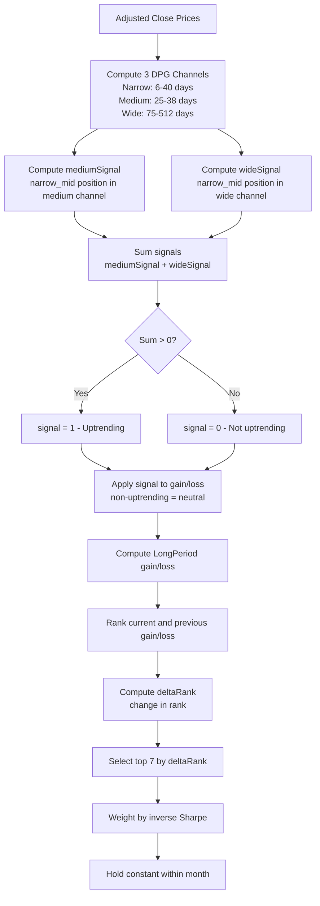

# Pine Method (Min-Max Channels) — Naz100_pine and SP500_pine Trading Models

**Last Updated:** February 9, 2026

---

## 1. Overview

The **Pine** method (also called **minmaxChannels**) is the signal generation strategy used by the **naz100_pine** and **sp500_pine** trading models. Unlike the SMAs and HMAs methods which use moving average crossovers, the Pine method determines uptrend status by analyzing the position of a smoothed price within nested min-max price channels of different widths.

- **Model names:** `naz100_pine` (Nasdaq 100), `sp500_pine` (S&P 500)
- **Stock universes:** Nasdaq 100 or S&P 500 respectively
- **Signal method identifier:** `uptrendSignalMethod = 'minmaxChannels'`
- **Implementation:** [`computeSignal2D()`](../functions/TAfunctions.py:1562) in `TAfunctions.py`, lines 1562–1602
- **Name origin:** "Pine" refers to the Pine Script language used by TradingView, where this channel-based approach was originally prototyped

> **Note:** The README references to "3 minmax method" for `pyTAAA_web` correspond to this method. The links in [`PyTAAA.py`](../PyTAAA.py:281) and [`run_pytaaa.py`](../run_pytaaa.py:300) confirm: `pyTAAA_web` = "3 minmax method" = minmaxChannels = Pine.

---

## 2. The DPG Channel (Min-Max Channel)

### 2.1 What Is a DPG Channel?

The DPG channel (named after the developer, DonaldPG) is a price envelope computed by averaging the rolling minimum and maximum of the price over multiple lookback periods. It creates a smooth channel that adapts to the price range.

### 2.2 DPG Channel Computation

The [`dpgchannel_2D()`](../functions/TAfunctions.py:569) function computes the channel:

```python
def dpgchannel_2D(x, minperiod, maxperiod, incperiod):
    periods = np.arange(minperiod, maxperiod, incperiod)
    minchannel = np.zeros((x.shape[0], x.shape[1]), dtype=float)
    maxchannel = np.zeros((x.shape[0], x.shape[1]), dtype=float)
    
    for i in range(x.shape[1]):       # for each date
        divisor = 0
        for j in range(len(periods)):  # for each lookback period
            minx = max(1, i - periods[j])
            minchannel[:, i] += np.min(x[:, minx:i+1], axis=-1)
            maxchannel[:, i] += np.max(x[:, minx:i+1], axis=-1)
            divisor += 1
        minchannel[:, i] /= divisor
        maxchannel[:, i] /= divisor
    
    return minchannel, maxchannel
```

**How it works:**
1. Define a set of lookback periods from `minperiod` to `maxperiod` with step `incperiod`
2. For each date, compute the rolling minimum and maximum over each lookback period
3. Average the minimums and maximums across all lookback periods
4. This produces a smooth channel that is less sensitive to any single lookback choice

### 2.3 Mathematical Formulation

For a price series P at time t, with lookback periods {p₁, p₂, ..., pₖ}:

```
minChannel(t) = (1/K) × Σⱼ₌₁ᴷ min(P[t-pⱼ : t])
maxChannel(t) = (1/K) × Σⱼ₌₁ᴷ max(P[t-pⱼ : t])
midChannel(t) = (minChannel(t) + maxChannel(t)) / 2
```

The channel width adapts to volatility: wider during volatile periods, narrower during calm periods.

---

## 3. Signal Generation: Three Nested Channels

### 3.1 The Three Channels

The Pine method computes three DPG channels of different widths:

| Channel | Variable | Period Range | Typical Values | Role |
|---|---|---|---|---|
| **Narrow** | `narrow_*` | `narrowDays[0]` to `narrowDays[1]` | 6.0 to 40.2 days | Smooths day-to-day noise |
| **Medium** | `medium_*` | `mediumDays[0]` to `mediumDays[1]` | 25.2 to 38.3 days | Intermediate trend |
| **Wide** | `wide_*` | `wideDays[0]` to `wideDays[1]` | 75.2 to 512.3 days | Long-term trend |

Each channel produces a `minChannel`, `maxChannel`, and `midChannel` (average of min and max).

### 3.2 Channel Signal Computation

Two normalized signals are computed from the channel positions:

**Medium Signal:**
```python
mediumSignal = ((narrow_midChannel - medium_minChannel) / 
                (medium_maxChannel - medium_minChannel) - 0.5) * 2.0
```

This measures where the narrow channel's midpoint sits within the medium channel, normalized to [-1, +1]:
- `mediumSignal = +1` → narrow mid is at the top of the medium channel (strong uptrend)
- `mediumSignal = 0` → narrow mid is at the center of the medium channel (neutral)
- `mediumSignal = -1` → narrow mid is at the bottom of the medium channel (strong downtrend)

**Wide Signal:**
```python
wideSignal = ((narrow_midChannel - wide_minChannel) / 
              (wide_maxChannel - wide_minChannel) - 0.5) * 2.0
```

Same concept but measuring the narrow channel's position within the wide channel.

### 3.3 Uptrend Signal Logic

A stock is classified as **uptrending** (signal = 1) when the sum of the medium and wide signals is positive:

```python
if mediumSignal[ii, jj] + wideSignal[ii, jj] > 0:
    signal2D[ii, jj] = 1
```

**Interpretation:** The stock is uptrending when its smoothed price (narrow channel midpoint) is, on average, in the upper half of both the medium-term and long-term price ranges. The sum allows a strong signal in one timeframe to compensate for a weak signal in the other.

### 3.4 Signal Diagram

```
Price
  │
  │    ╱╲        ╱╲
  │   ╱  ╲      ╱  ╲         ← Adjusted Close Price
  │  ╱    ╲    ╱    ╲
  │ ╱      ╲  ╱      ╲
  │╱        ╲╱        ╲
  │
  │ ┌─────────────────────┐
  │ │  Wide Channel        │  ← wide_maxChannel
  │ │                      │
  │ │  ┌───────────────┐   │
  │ │  │ Medium Channel │   │  ← medium_maxChannel
  │ │  │               │   │
  │ │  │  ┌─────────┐  │   │
  │ │  │  │ Narrow  │  │   │  ← narrow_maxChannel
  │ │  │  │ Channel │  │   │
  │ │  │  │  ═══════│══│═══│═ ← narrow_midChannel
  │ │  │  │         │  │   │
  │ │  │  └─────────┘  │   │  ← narrow_minChannel
  │ │  │               │   │
  │ │  └───────────────┘   │  ← medium_minChannel
  │ │                      │
  │ └─────────────────────┘   ← wide_minChannel
  │
  ├──────────────────────────── Time

Signal = 1 when:
  mediumSignal + wideSignal > 0
  
  where mediumSignal = position of narrow_mid within medium channel
        wideSignal   = position of narrow_mid within wide channel
```

### 3.5 How the Pine Method Differs from SMAs/HMAs

| Property | SMAs/HMAs | Pine (minmaxChannels) |
|---|---|---|
| **Signal basis** | Price vs. moving averages | Channel position (relative) |
| **Absolute vs. relative** | Absolute price comparison | Relative position within range |
| **Volatility adaptation** | Fixed MA periods | Channels widen/narrow with volatility |
| **Number of indicators** | 3 moving averages | 3 nested channels (6 boundaries) |
| **Signal type** | Binary crossover | Continuous position, thresholded |
| **Sensitivity** | Depends on MA period | Depends on channel width parameters |

**Key advantage of the Pine method:** Because it uses relative position within channels rather than absolute price comparisons, it naturally adapts to stocks with different price levels and volatility characteristics. A $500 stock and a $50 stock are treated equivalently based on their position within their respective channels.

---

## 4. Ranking Strategy: Change-in-Rank (deltaRank)

The ranking strategy is **identical** for all signal methods. It is implemented in [`sharpeWeightedRank_2D()`](../functions/TAfunctions.py:2731) and is fully documented in [`docs/SMAs_method.md`](SMAs_method.md).

### 4.1 Summary

The ranking selects stocks whose rank is **improving the fastest** (deltaRank), not stocks with the best absolute rank:

1. Compute gain/loss over `LongPeriod` days, filtered by Pine channel signal
2. Rank stocks by current gain/loss
3. Rank stocks by previous-period gain/loss
4. Compute **delta** = weighted change in rank
5. Rank the deltas → **deltaRank**
6. Select top N stocks by deltaRank
7. Weight by inverse rolling Sharpe ratio
8. Hold constant within calendar month

### 4.2 How the Pine Signal Affects Ranking

The Pine method's channel-based signal affects the ranking through the uptrend filter:

- **Volatility-adaptive filtering:** During high-volatility periods, the channels widen, making it harder for a stock to reach the upper half. This naturally reduces the number of stocks flagged as uptrending during volatile markets.
- **Smoother transitions:** Because the signal is based on the sum of two continuous signals (medium + wide), transitions between uptrend and downtrend are smoother than the binary crossover in SMAs/HMAs.
- **Regime sensitivity:** The wide channel (75-512 days) captures long-term market regimes. A stock must be in the upper half of its long-term range to be considered uptrending, which filters out stocks in secular decline.

### 4.3 Ranking Flow Diagram



---

## 5. Indicators Used as Inputs to Ranking

### 5.1 Primary Indicators

| Indicator | Purpose | Implementation |
|---|---|---|
| **Narrow DPG Channel** | Smooths day-to-day noise (6-40 day range) | [`dpgchannel_2D()`](../functions/TAfunctions.py:569) |
| **Medium DPG Channel** | Intermediate trend (25-38 day range) | [`dpgchannel_2D()`](../functions/TAfunctions.py:569) |
| **Wide DPG Channel** | Long-term trend (75-512 day range) | [`dpgchannel_2D()`](../functions/TAfunctions.py:569) |
| **mediumSignal** | Narrow mid position in medium channel [-1, +1] | Computed inline |
| **wideSignal** | Narrow mid position in wide channel [-1, +1] | Computed inline |
| **LongPeriod gain/loss** | Performance over ~600 days, filtered by channel signal | Direct price ratio |
| **Rolling Sharpe ratio** | Risk-adjusted return over LongPeriod | [`move_sharpe_2D()`](../functions/TAfunctions.py:1450) |

### 5.2 Secondary Indicators (QC and display only)

Same as SMAs method — see [`docs/SMAs_method.md`](SMAs_method.md) Section 4.2.

---

## 6. Synthetic Charts and Examples

### 6.0 Generated Charts

The following charts are generated by [`docs/generate_method_charts.py`](generate_method_charts.py) using synthetic price data. Run `uv run python docs/generate_method_charts.py` to regenerate.

#### Pine Channel Signal Generation

*Top panel: price with three nested DPG channels (wide=red, medium=blue, narrow=green). Second panel: medium and wide signals with combined sum. Third panel: binary uptrend signal. Bottom panel: narrow mid position within wide channel.*

#### deltaRank Ranking Strategy

*From top to bottom: stock prices, absolute rank, delta (rank improvement), and deltaRank (final selection). Green zone in bottom panel = selected for portfolio.*

---

### 6.1 Channel Position and Signal Generation

Consider a stock with the following price action over 100 days:

```
Day:     1    20    40    60    80    100
Price:   100  95    90    95    105   110

Narrow Channel (6-40 day):
  min:   100  93    88    90    95    105
  max:   100  100   100   97    107   112
  mid:   100  96.5  94    93.5  101   108.5

Medium Channel (25-38 day):
  min:   100  93    88    88    90    95
  max:   100  100   100   100   107   112
  mid:   100  96.5  94    94    98.5  103.5

Wide Channel (75-512 day):
  min:   100  93    88    88    88    88
  max:   100  100   100   100   107   112
  mid:   100  96.5  94    94    97.5  100

mediumSignal:
  Day 40: (94 - 88) / (100 - 88) - 0.5 = 0.5 - 0.5 = 0.0  → ×2 = 0.0
  Day 80: (101 - 90) / (107 - 90) - 0.5 = 0.647 - 0.5 = 0.147 → ×2 = +0.294
  Day 100: (108.5 - 95) / (112 - 95) - 0.5 = 0.794 - 0.5 = 0.294 → ×2 = +0.588

wideSignal:
  Day 40: (94 - 88) / (100 - 88) - 0.5 = 0.0 → ×2 = 0.0
  Day 80: (101 - 88) / (107 - 88) - 0.5 = 0.684 - 0.5 = 0.184 → ×2 = +0.368
  Day 100: (108.5 - 88) / (112 - 88) - 0.5 = 0.854 - 0.5 = 0.354 → ×2 = +0.708

Sum (medium + wide):
  Day 40:  0.0 + 0.0 = 0.0    → Signal = 0 (not uptrending)
  Day 80:  0.294 + 0.368 = 0.662 → Signal = 1 (uptrending)
  Day 100: 0.588 + 0.708 = 1.296 → Signal = 1 (strongly uptrending)
```

**Interpretation:** The stock transitions from neutral (day 40, price at channel midpoint) to uptrending (day 80, price in upper portion of channels) as it recovers and makes new highs.

### 6.2 Comparison with SMAs/HMAs for Same Price Action

For the same price series, the SMAs method would generate:
- Day 40: Price (90) likely below SMA(176) → Signal = 0
- Day 80: Price (105) may be above short SMAs but SMA(176) still reflects the earlier decline → Signal depends on SMA values
- Day 100: Price (110) likely above all SMAs → Signal = 1

The Pine method's channel-based approach adapts to the stock's own price range, while the SMAs method compares against absolute moving average levels. This makes the Pine method more responsive to stocks that are recovering within their own historical range.

---

## 7. Differences Between naz100_pine and sp500_pine

| Property | naz100_pine | sp500_pine |
|---|---|---|
| Stock universe | Nasdaq 100 (~100 stocks) | S&P 500 (~500 stocks) |
| Symbol file | `Naz100_Symbols.txt` | `SP500_Symbols.txt` |
| HDF5 file | `Naz100_Symbols_.hdf5` | `SP500_Symbols_.hdf5` |
| Universe characteristics | Tech-heavy, higher volatility | Broader market, lower volatility |
| Channel behavior | Wider channels due to higher volatility | Narrower channels, more stocks near boundaries |
| Rank threshold effect | Top 7 of ~100 = top 7% | Top 7 of ~500 = top 1.4% |

---

## 8. Configuration Parameters

| Parameter | JSON Key | Typical Value | Description |
|---|---|---|---|
| Narrow channel min | `narrowDays_min` | 6.0 | Shortest lookback for narrow channel |
| Narrow channel max | `narrowDays_max` | 40.2 | Longest lookback for narrow channel |
| Medium channel min | `mediumDays_min` | 25.2 | Shortest lookback for medium channel |
| Medium channel max | `mediumDays_max` | 38.3 | Longest lookback for medium channel |
| Wide channel min | `wideDays_min` | 75.2 | Shortest lookback for wide channel |
| Wide channel max | `wideDays_max` | 512.3 | Longest lookback for wide channel |
| Long period | `LongPeriod` | 600 | Lookback for gain/loss ranking |
| Stocks traded | `numberStocksTraded` | 7 | Number of stocks in portfolio |
| Rank threshold % | `rankThresholdPct` | 0.133 | Exclude stocks below this percentile |
| Risk downside min | `riskDownside_min` | 0.467 | Minimum Sharpe-based risk weight |
| Risk downside max | `riskDownside_max` | 9.027 | Maximum Sharpe-based risk weight |
| Months to hold | `monthsToHold` | 1 | Rebalancing frequency |

---

## 9. References

1. **Donchian Channels:** Donchian, R.D. (1960). The DPG channel is conceptually related to Donchian channels (highest high / lowest low over N periods), but averages across multiple lookback periods for smoothing. See Kaufman, P.J. (2013), *Trading Systems and Methods*, 5th Edition, Chapter 8.

2. **Price Channel Breakout Systems:** Brock, W., Lakonishok, J., & LeBaron, B. (1992). "Simple Technical Trading Rules and the Stochastic Properties of Stock Returns." *Journal of Finance*, 47(5), 1731-1764. Channel-based trading rules have been studied extensively in the academic literature.

3. **Adaptive Channels:** The multi-period averaging approach in `dpgchannel_2D()` is a form of adaptive channel that reduces sensitivity to any single lookback period. This is related to the concept of "fractal adaptive moving averages" discussed in Ehlers, J.F. (2005), *Cybernetic Analysis for Stocks and Futures*.

4. **Relative Strength within Channels:** The mediumSignal and wideSignal normalize the price position to [-1, +1], which is a form of relative strength indicator. This is conceptually similar to the Stochastic Oscillator (Lane, 1984) but applied to channel positions rather than raw prices.

5. **Pine Script:** TradingView's Pine Script language (https://www.tradingview.com/pine-script-docs/) is a domain-specific language for creating custom technical indicators. The "Pine" model name reflects the original prototyping of this channel-based approach in Pine Script before implementation in Python.

6. **Momentum-of-Momentum Ranking:** The deltaRank approach used by all models is documented in [`docs/SMAs_method.md`](SMAs_method.md) Section 3. See Jegadeesh & Titman (1993) for the foundational momentum literature.
