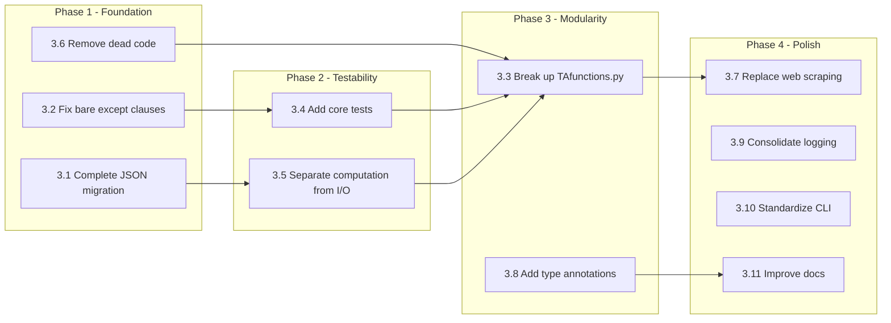

# PyTAAA Recommendations: Strengths, Weaknesses, and Improvements

**Last Updated:** February 9, 2026

---

## 1. Strengths

### 1.1 Comprehensive Trading Framework

PyTAAA provides a complete end-to-end pipeline from data acquisition through signal generation, backtesting, trade recommendation, and web-based reporting. Few personal trading systems achieve this level of integration.

**Evidence:** The pipeline in [`run_pytaaa.py`](../run_pytaaa.py:32) covers quote download → signal computation → ranking → backtesting → trade calculation → email notification → web page generation in a single execution path.

### 1.2 Multi-Model Architecture with Meta-Model Selection

The Abacus model-switching system is a genuinely sophisticated approach. Rather than committing to a single signal method, it evaluates multiple models (5 base models + cash) and dynamically selects the best performer using normalized scoring across multiple lookback periods.

**Evidence:** [`MonteCarloBacktest.py`](../functions/MonteCarloBacktest.py:1) implements a full Monte Carlo optimization engine with Numba-accelerated computations, explore/exploit search strategies, and state persistence. The [`recommend_model.py`](../recommend_model.py:1) entry point provides actionable monthly recommendations.

### 1.3 Robust Data Management

The HDF5-based quote storage system is well-suited for the data volumes involved (~500 symbols × ~8,000 trading days). Incremental updates via [`UpdateHDF_yf()`](../functions/UpdateSymbols_inHDF5.py:679) avoid re-downloading the full history each time.

**Evidence:** The system handles stock splits, index composition changes, and data quality issues (interpolation, spike removal, boundary cleaning) through a multi-stage cleaning pipeline.

### 1.4 Extensive Technical Analysis Library

[`TAfunctions.py`](../functions/TAfunctions.py:1) contains over 4,100 lines of technical analysis functions covering moving averages (SMA, HMA), channel analysis, Sharpe-weighted ranking, trend detection, and market breadth indicators. This represents significant domain expertise encoded in code.

### 1.5 Recent Refactoring Progress

The Abacus subsystem shows evidence of deliberate architectural improvement:
- [`recommend_model.py`](../recommend_model.py:1) was refactored from 671 lines to 165 lines (75% reduction) per [`.github/RECOMMEND_MODEL_REFACTORING_PLAN.md`](../.github/RECOMMEND_MODEL_REFACTORING_PLAN.md:1)
- New modules [`abacus_recommend.py`](../functions/abacus_recommend.py:1) and [`abacus_backtest.py`](../functions/abacus_backtest.py:1) use proper class-based design
- Centralized logging via [`logger_config.py`](../functions/logger_config.py:1)
- JSON configuration migration from legacy `.params` files

### 1.6 Automation-Ready Design

The system is designed for unattended operation:
- Cron-compatible entry points ([`daily_abacus_update.py`](../daily_abacus_update.py:1))
- Smart quote update logic (skip when market closed or data fresh)
- Email notifications on portfolio changes
- State persistence for Monte Carlo resume capability

### 1.7 Complementary Web Application

The [`pytaaa_web`](/Users/donaldpg/PyProjects/pytaaa_web) FastAPI application provides a modern, database-backed dashboard that cleanly separates visualization from computation. This is a sound architectural decision — the computation engine and the presentation layer are independent codebases.

---

## 2. Weaknesses

### 2.1 Monolithic Function Design in Core Modules

**Problem:** [`TAfunctions.py`](../functions/TAfunctions.py:1) is a single 4,100+ line file containing ~60 functions with no class organization. [`PortfolioPerformanceCalcs.py`](../functions/PortfolioPerformanceCalcs.py:37) is a single function that orchestrates the entire computation pipeline. [`dailyBacktest_pctLong.py`](../functions/dailyBacktest_pctLong.py:1) contains plotting functions exceeding 500 lines each.

**Impact:** Difficult to test individual components, understand data flow, or modify behavior without risk of side effects. The lack of modularity makes it hard to reuse signal generation logic across different contexts.

**Evidence:** [`TAfunctions.py`](../functions/TAfunctions.py:1) contains multiple versions of the same function (e.g., four definitions of [`get_MarketOpenOrClosed()`](../functions/CheckMarketOpen.py:10) in `CheckMarketOpen.py`, three definitions of [`interpolate()`](../functions/TAfunctions.py:200) in `TAfunctions.py`, three definitions of [`get_SectorAndIndustry_google()`](../functions/quotes_for_list_adjClose.py:1132) in `quotes_for_list_adjClose.py`). Only the last definition in each file is active; earlier versions are dead code or commented-out alternatives.

### 2.2 Dual Configuration System Creates Confusion

**Problem:** The codebase maintains two parallel configuration systems — legacy `.params` files and modern JSON. [`GetParams.py`](../functions/GetParams.py:1) contains both [`GetParams()`](../functions/GetParams.py:551) (legacy) and [`get_json_params()`](../functions/GetParams.py:219) (modern), along with their corresponding holdings, status, and FTP parameter functions.

**Impact:** New developers must understand both systems. Bugs can arise from inconsistencies between the two. The legacy system uses hardcoded paths (e.g., `"C:\\Users\\Don\\Py3TAAA"` in [`PyTAAA.py`](../PyTAAA.py:32)) that are platform-specific.

**Evidence:** [`GetParams.py`](../functions/GetParams.py:1) is 960+ lines, with roughly half dedicated to legacy functions that duplicate the JSON-based equivalents.

### 2.3 Pervasive Bare `except` Clauses

**Problem:** The codebase uses bare `except:` clauses extensively, catching all exceptions including `KeyboardInterrupt` and `SystemExit`. This masks errors and makes debugging difficult.

**Impact:** Silent failures. When something goes wrong, the code often prints a generic message and continues, potentially producing incorrect results without the user knowing.

**Evidence:**
- [`PyTAAA.py`](../PyTAAA.py:29): `except: os.chdir("C:\\Users\\Don\\Py3TAAA")`
- [`run_pytaaa.py`](../run_pytaaa.py:26): `except: os.chdir("/Users/donaldpg/PyProjects/PyTAAA.master")`
- [`WriteWebPage_pi.py`](../functions/WriteWebPage_pi.py:161): `except: print(" Unable to create updated web page...")`
- [`CheckMarketOpen.py`](../functions/CheckMarketOpen.py:24): `except: status = 'no Market Open/Closed status available'`
- Multiple instances in [`TAfunctions.py`](../functions/TAfunctions.py:1), [`stock_cluster.py`](../functions/stock_cluster.py:1), and others

### 2.4 Dead Code and Commented-Out Alternatives

**Problem:** Significant amounts of dead code exist throughout the codebase — commented-out function definitions, unused imports, and superseded implementations that remain in the source files.

**Impact:** Increases cognitive load, makes files harder to navigate, and creates ambiguity about which implementation is active.

**Evidence:**
- [`quotes_for_list_adjClose.py`](../functions/quotes_for_list_adjClose.py:1): Lines 17-80 contain a large commented-out class and function
- [`TAfunctions.py`](../functions/TAfunctions.py:35): Multiple commented-out versions of `interpolate()` and `cleantobeginning()`
- [`CheckMarketOpen.py`](../functions/CheckMarketOpen.py:28): Contains 4 definitions of `get_MarketOpenOrClosed()` — only the last one is used
- [`re-generateHDF5.py`](../re-generateHDF5.py:1): Uses Python 2 syntax (`print` statements, `nose`, `la` imports) and is non-functional

### 2.5 Lack of Automated Testing for Core Logic

**Problem:** The test suite ([`tests/`](../tests/)) contains only 5 test files, all focused on the Abacus subsystem (JSON config, model recommendation). There are no tests for the core trading logic: signal generation, ranking, backtesting, trade calculation, or quote management.

**Impact:** Changes to [`TAfunctions.py`](../functions/TAfunctions.py:1), [`dailyBacktest.py`](../functions/dailyBacktest.py:1), [`calculateTrades.py`](../functions/calculateTrades.py:1), or [`PortfolioPerformanceCalcs.py`](../functions/PortfolioPerformanceCalcs.py:1) cannot be validated automatically. Regressions may go undetected.

**Evidence:** Test files are limited to:
- [`test_abacus_backtest.py`](../tests/test_abacus_backtest.py)
- [`test_abacus_recommend.py`](../tests/test_abacus_recommend.py)
- [`test_getparams_json_extensions.py`](../tests/test_getparams_json_extensions.py)
- [`test_models_resolve.py`](../tests/test_models_resolve.py)
- [`test_recommend_model_json.py`](../tests/test_recommend_model_json.py)
- [`test_run_monte_carlo_json.py`](../tests/test_run_monte_carlo_json.py)

### 2.6 Tight Coupling Between Computation and I/O

**Problem:** Core computation functions directly read from and write to files. For example, [`PortfolioPerformanceCalcs()`](../functions/PortfolioPerformanceCalcs.py:37) loads quotes from HDF5, computes signals, runs backtests, generates plots, and writes `.params` files — all in one function call.

**Impact:** Cannot unit test computation logic without file system access. Cannot reuse computation in different contexts (e.g., web API) without the file I/O side effects.

**Evidence:** [`PortfolioPerformanceCalcs()`](../functions/PortfolioPerformanceCalcs.py:37) calls `loadQuotes_fromHDF()`, `computeDailyBacktest()`, `plotRecentPerfomance3()`, and writes to `pyTAAAweb_backtestPortfolioValue.params` — mixing data loading, computation, visualization, and persistence in a single function.

### 2.7 Hardcoded Paths and Platform Assumptions

**Problem:** Several files contain hardcoded absolute paths specific to the developer's machine.

**Impact:** The code is not portable without modification. New users or deployment to different machines requires manual path updates.

**Evidence:**
- [`PyTAAA.py`](../PyTAAA.py:32): `os.chdir("C:\\Users\\Don\\Py3TAAA")`
- [`run_pytaaa.py`](../run_pytaaa.py:29): `os.chdir("/Users/donaldpg/PyProjects/PyTAAA.master")`
- [`abacus_backtest.py`](../functions/abacus_backtest.py:71): `base_folder = "/Users/donaldpg/pyTAAA_data"`
- [`run_normalized_score_history.py`](../run_normalized_score_history.py:51): Hardcoded path to `pytaaa_model_switching_params.json`

### 2.8 Duplicate Code Across Modules

**Problem:** Several functions are duplicated across files with minor variations.

**Impact:** Bug fixes must be applied in multiple places. Behavior may diverge between copies over time.

**Evidence:**
- `AllocationComputer` class exists in both [`compute_allocations.py`](../compute_allocations.py:36) and [`compute_new_allocations.py`](../compute_new_allocations.py:23)
- `interpolate()`, `cleantobeginning()`, `cleantoend()`, `cleanspikes()` are duplicated between [`TAfunctions.py`](../functions/TAfunctions.py:1) and [`clean_quote_data.py`](../functions/clean_quote_data.py:1)
- `strip_accents()` is duplicated in [`TAfunctions.py`](../functions/TAfunctions.py:17) and [`readSymbols.py`](../functions/readSymbols.py:26)
- `get_SectorAndIndustry_google()` has three definitions in [`quotes_for_list_adjClose.py`](../functions/quotes_for_list_adjClose.py:1085)

### 2.9 No Type Annotations in Legacy Code

**Problem:** The original codebase (pre-Abacus) has no type annotations. Function signatures like `def computeDailyBacktest(json_fn, datearray, symbols, adjClose, numberStocksTraded=7, ...)` give no indication of expected types.

**Impact:** IDE support is limited, documentation is implicit, and runtime type errors are discovered late.

**Evidence:** Newer modules like [`PortfolioMetrics.py`](../functions/PortfolioMetrics.py:1), [`abacus_recommend.py`](../functions/abacus_recommend.py:1), and [`MonteCarloBacktest.py`](../functions/MonteCarloBacktest.py:1) use proper type annotations, but the core modules ([`TAfunctions.py`](../functions/TAfunctions.py:1), [`dailyBacktest.py`](../functions/dailyBacktest.py:1), [`PortfolioPerformanceCalcs.py`](../functions/PortfolioPerformanceCalcs.py:1)) do not.

### 2.10 Web Scraping Fragility

**Problem:** Market status detection ([`CheckMarketOpen.py`](../functions/CheckMarketOpen.py:1)) and index composition updates rely on web scraping of Yahoo Finance and Wikipedia pages. These scrapers break when the target websites change their HTML structure.

**Impact:** Silent failures in market status detection and index composition tracking. The multiple definitions of `get_MarketOpenOrClosed()` in [`CheckMarketOpen.py`](../functions/CheckMarketOpen.py:1) are evidence of repeated breakage and patching.

**Evidence:** Four definitions of [`get_MarketOpenOrClosed()`](../functions/CheckMarketOpen.py:10) exist in the file, each targeting a different URL or parsing strategy, suggesting the function has been rewritten multiple times as scraped sites changed.

---

## 3. Actionable Recommendations

### 3.1 HIGH PRIORITY: Complete the Legacy-to-JSON Migration

**What:** Remove the legacy `.params`-based configuration system entirely. Migrate all entry points to use JSON configuration exclusively.

**Why:** The dual system creates confusion, doubles the maintenance burden in [`GetParams.py`](../functions/GetParams.py:1), and the legacy system contains hardcoded Windows paths. The JSON system is already the primary path for all modern entry points.

**How:**
1. Audit all callers of legacy functions (`GetParams()`, `GetHoldings()`, `GetStatus()`, `PutStatus()`, `GetFTPParams()`)
2. Replace with JSON equivalents (`get_json_params()`, `get_holdings()`, `get_status()`, `put_status()`, `get_json_ftp_params()`)
3. Remove legacy functions from [`GetParams.py`](../functions/GetParams.py:1)
4. Deprecate [`PyTAAA.py`](../PyTAAA.py:1) in favor of [`pytaaa_main.py`](../pytaaa_main.py:1)

**Reference:** The JSON migration pattern is already established in the codebase. See [`run_pytaaa.py`](../run_pytaaa.py:32) for the target pattern.

### 3.2 HIGH PRIORITY: Add Exception Specificity

**What:** Replace all bare `except:` clauses with specific exception types.

**Why:** Bare `except` catches `KeyboardInterrupt`, `SystemExit`, and `GeneratorExit` in addition to actual errors. This masks bugs and prevents clean shutdown. Python best practices (PEP 8) explicitly discourage bare `except` [1].

**How:**
1. Search for all `except:` occurrences (there are dozens)
2. For each, determine the expected failure mode and catch the specific exception (`FileNotFoundError`, `ValueError`, `ConnectionError`, etc.)
3. Add logging for caught exceptions instead of silent `pass` or generic `print`
4. Use `except Exception as e:` as a minimum improvement where the specific type is unclear

**Reference:** PEP 8 — "When catching exceptions, mention specific exceptions whenever possible instead of using a bare `except:` clause." [1]

### 3.3 HIGH PRIORITY: Break Up TAfunctions.py

**What:** Split [`TAfunctions.py`](../functions/TAfunctions.py:1) (4,100+ lines) into focused modules.

**Why:** A single 4,100-line file is difficult to navigate, test, and maintain. Functions within it serve distinct purposes that map naturally to separate modules.

**How:** Suggested decomposition:

| New Module | Functions to Move | Approximate Lines |
|---|---|---|
| `functions/moving_averages.py` | `SMA()`, `SMA_2D()`, `hma()`, `hma_pd()`, `SMS()`, `SMA_filtered_2D()` | ~200 |
| `functions/channels.py` | `dpgchannel()`, `dpgchannel_2D()`, `percentileChannel()`, `percentileChannel_2D()`, `jumpTheChannelTest()`, `recentChannelFit()` | ~400 |
| `functions/trend_analysis.py` | `recentTrendAndStdDevs()`, `recentTrendAndMidTrendChannelFitWithAndWithoutGap()`, `recentTrendComboGain()`, `recentSharpeWithAndWithoutGap()` | ~500 |
| `functions/signal_generation.py` | `computeSignal2D()` | ~200 |
| `functions/ranking.py` | `sharpeWeightedRank_2D()`, `MAA_WeightedRank_2D()`, `UnWeightedRank_2D()` | ~1500 |
| `functions/data_cleaning.py` | `interpolate()`, `cleantobeginning()`, `cleantoend()`, `cleanspikes()`, `despike_2D()`, `clean_signal()` | ~200 |
| `functions/rolling_metrics.py` | `move_sharpe_2D()`, `move_martin_2D()`, `move_informationRatio()`, `multiSharpe()` | ~300 |

Maintain a `functions/TAfunctions.py` that re-exports everything for backward compatibility:
```python
from functions.moving_averages import *
from functions.channels import *
# etc.
```

**Reference:** Martin Fowler, *Refactoring: Improving the Design of Existing Code* (2018). "Long Method" and "Large Class" are classic code smells addressed by Extract Method and Extract Class refactorings [2].

### 3.4 MEDIUM PRIORITY: Add Tests for Core Trading Logic

**What:** Create unit tests for signal generation, ranking, backtesting, and trade calculation.

**Why:** The core trading logic has zero test coverage. Any refactoring (including recommendation 3.3) requires tests to verify correctness.

**How:**
1. Create test fixtures with known input data (small synthetic price arrays)
2. Write tests for:
   - `computeSignal2D()` — verify signal output for known price patterns
   - `sharpeWeightedRank_2D()` — verify ranking order for known inputs
   - `computeDailyBacktest()` — verify portfolio value calculation
   - `calculateTrades()` — verify trade recommendations for known holdings/targets
   - `interpolate()`, `cleantobeginning()` — verify data cleaning
3. Use the existing test infrastructure (`pytest`, [`tests/`](../tests/) directory)

**Reference:** The Abacus subsystem tests provide a good template. See [`tests/test_abacus_backtest.py`](../tests/test_abacus_backtest.py) for the pattern.

### 3.5 MEDIUM PRIORITY: Separate Computation from I/O

**What:** Refactor core functions to accept data as parameters rather than reading from files internally.

**Why:** Enables unit testing, reuse in different contexts (e.g., web API), and clearer data flow.

**How:** For [`PortfolioPerformanceCalcs()`](../functions/PortfolioPerformanceCalcs.py:37):
1. Extract data loading into a separate function that returns `adjClose`, `symbols`, `datearray`
2. Make `PortfolioPerformanceCalcs()` accept these arrays as parameters
3. Extract plot generation into a separate function
4. Extract `.params` file writing into a separate function
5. Create a new orchestration function that calls all three in sequence

This pattern is already demonstrated in the Abacus subsystem where [`BacktestDataLoader`](../functions/abacus_backtest.py:20) handles data loading separately from [`ModelRecommender`](../functions/abacus_recommend.py:1) which handles computation.

### 3.6 MEDIUM PRIORITY: Remove Dead Code

**What:** Delete commented-out code, unused function definitions, and non-functional scripts.

**Why:** Dead code increases cognitive load and creates ambiguity about which implementation is active. It also inflates file sizes unnecessarily.

**How:**
1. Delete [`re-generateHDF5.py`](../re-generateHDF5.py:1) (Python 2 syntax, non-functional) or rewrite for Python 3
2. Remove the three superseded definitions of `get_MarketOpenOrClosed()` in [`CheckMarketOpen.py`](../functions/CheckMarketOpen.py:1)
3. Remove commented-out function definitions in [`TAfunctions.py`](../functions/TAfunctions.py:1) and [`quotes_for_list_adjClose.py`](../functions/quotes_for_list_adjClose.py:1)
4. Consolidate [`compute_allocations.py`](../compute_allocations.py:1) and [`compute_new_allocations.py`](../compute_new_allocations.py:1) into a single module
5. Remove the two superseded definitions of `get_SectorAndIndustry_google()` in [`quotes_for_list_adjClose.py`](../functions/quotes_for_list_adjClose.py:1085)

**Reference:** Robert C. Martin, *Clean Code* (2008). "Dead code is code that is not executed... It was written at some point but is no longer needed. Delete it." [3]

### 3.7 MEDIUM PRIORITY: Replace Web Scraping with API-Based Data Sources

**What:** Replace fragile web scraping for market status and index composition with more reliable data sources.

**Why:** Web scraping breaks when target sites change their HTML structure. The multiple definitions of `get_MarketOpenOrClosed()` are evidence of repeated breakage.

**How:**
1. **Market status:** Use `pandas_market_calendars` (already a dependency) to determine if the market is open based on the current date/time. This is deterministic and doesn't require network access.
2. **Index composition:** Use `yfinance` ticker info or a dedicated financial data API instead of scraping Wikipedia. Alternatively, maintain a local JSON file with index composition that is updated manually or via a more stable API.

**Reference:** `pandas_market_calendars` is already imported in [`readSymbols.py`](../functions/readSymbols.py:9) but not used for market status detection.

### 3.8 LOW PRIORITY: Add Type Annotations to Legacy Code

**What:** Add Python type annotations to all function signatures in the core modules.

**Why:** Improves IDE support, serves as documentation, and enables static type checking with `mypy`.

**How:**
1. Start with the most-called functions: `computeSignal2D()`, `sharpeWeightedRank_2D()`, `computeDailyBacktest()`
2. Use `numpy.ndarray` for array parameters, `List[str]` for symbol lists, etc.
3. Add return type annotations
4. Follow the pattern established in newer modules like [`PortfolioMetrics.py`](../functions/PortfolioMetrics.py:1)

**Reference:** PEP 484 — "Type Hints" [4]. The newer Abacus modules already follow this pattern.

### 3.9 LOW PRIORITY: Consolidate Logging

**What:** Migrate all `print()` statements in core modules to use the centralized logging system.

**Why:** [`logger_config.py`](../functions/logger_config.py:1) provides a well-designed logging infrastructure with rotating file handlers, but the core modules still use `print()` for all output. This makes it impossible to control verbosity or redirect output to files.

**How:**
1. Replace `print()` calls with `logger.info()`, `logger.debug()`, or `logger.warning()` as appropriate
2. Use `logger.debug()` for diagnostic output that is currently always printed
3. Keep `print()` only for user-facing CLI output in entry points

**Evidence:** [`run_pytaaa.py`](../run_pytaaa.py:24) starts with `print(sys.path)` — a debugging statement that should be `logger.debug()`. [`PortfolioPerformanceCalcs.py`](../functions/PortfolioPerformanceCalcs.py:39) uses `print()` for all status messages.

### 3.10 LOW PRIORITY: Standardize the Entry Point Pattern

**What:** Adopt a consistent pattern for all CLI entry points using Click.

**Why:** Entry points currently use a mix of Click ([`pytaaa_main.py`](../pytaaa_main.py:1), [`recommend_model.py`](../recommend_model.py:1), [`run_monte_carlo.py`](../run_monte_carlo.py:1)), argparse ([`daily_abacus_update.py`](../daily_abacus_update.py:1)), and no CLI framework ([`PyTAAA.py`](../PyTAAA.py:1)).

**How:**
1. Migrate [`daily_abacus_update.py`](../daily_abacus_update.py:1) from argparse to Click
2. Ensure all entry points accept `--json` for configuration
3. Add `--verbose` flag consistently
4. Consider a Click group command to unify all entry points under a single `pytaaa` CLI

**Reference:** Click documentation recommends using `@click.group()` for multi-command CLIs [5].

### 3.11 LOW PRIORITY: Improve Documentation Consistency

**What:** Standardize docstrings across all modules using a consistent format.

**Why:** Newer modules use Google-style docstrings with type annotations, while older modules have no docstrings or use inconsistent formats.

**How:**
1. Adopt Google-style docstrings as the standard (already used in newer modules)
2. Add module-level docstrings to all files
3. Add function-level docstrings to all public functions
4. Use `sphinx` or `mkdocs` to generate API documentation from docstrings

---

## 4. Prioritized Improvement Roadmap



### Phase 1: Foundation
- Fix bare `except` clauses (3.2) — prevents silent failures during subsequent work
- Remove dead code (3.6) — reduces noise before refactoring
- Complete JSON migration (3.1) — eliminates dual-system confusion

### Phase 2: Testability
- Add core tests (3.4) — establishes safety net for refactoring
- Separate computation from I/O (3.5) — enables unit testing

### Phase 3: Modularity
- Break up TAfunctions.py (3.3) — requires tests from Phase 2
- Add type annotations (3.8) — easier after modules are smaller

### Phase 4: Polish
- Replace web scraping (3.7)
- Consolidate logging (3.9)
- Standardize CLI (3.10)
- Improve documentation (3.11)

---

## 5. References

[1] van Rossum, G., Warsaw, B., & Coghlan, N. (2001). "PEP 8 — Style Guide for Python Code." https://peps.python.org/pep-0008/#programming-recommendations. "When catching exceptions, mention specific exceptions whenever possible instead of using a bare `except:` clause."

[2] Fowler, M. (2018). *Refactoring: Improving the Design of Existing Code*, 2nd Edition. Addison-Wesley. Chapters on "Long Method" (p. 73) and "Large Class" (p. 78) code smells.

[3] Martin, R.C. (2008). *Clean Code: A Handbook of Agile Software Craftsmanship*. Prentice Hall. Chapter 17: "Smells and Heuristics" — G9: Dead Code.

[4] van Rossum, G., Lehtosalo, J., & Langa, Ł. (2014). "PEP 484 — Type Hints." https://peps.python.org/pep-0484/.

[5] Pallets Projects. "Click — Commands and Groups." https://click.palletsprojects.com/en/8.1.x/commands/.

[6] Gamma, E., Helm, R., Johnson, R., & Vlissides, J. (1994). *Design Patterns: Elements of Reusable Object-Oriented Software*. Addison-Wesley. The Strategy pattern (p. 315) is relevant to the signal method selection architecture.

[7] Python Software Foundation. "logging — Logging facility for Python." https://docs.python.org/3/library/logging.html. Best practices for application logging.

[8] The HDF Group. "Best Practices for HDF5." https://www.hdfgroup.org/solutions/hdf5/. Guidelines for efficient HDF5 usage.

[9] Faber, M.T. (2007). "A Quantitative Approach to Tactical Asset Allocation." *Journal of Wealth Management*, 9(4), 69-79. The foundational paper for momentum-based TAA strategies that PyTAAA implements.

[10] DeMiguel, V., Garlappi, L., & Uppal, R. (2009). "Optimal Versus Naive Diversification: How Inefficient is the 1/N Portfolio Strategy?" *Review of Financial Studies*, 22(5), 1915-1953. Relevant to evaluating whether PyTAAA's optimization adds value over simple equal-weight strategies.
