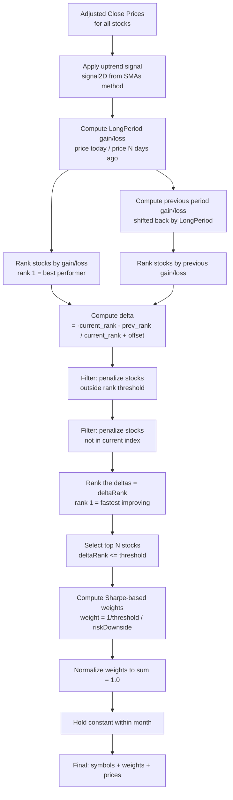

# SMAs Method — Naz100_pi Trading Model

**Last Updated:** February 9, 2026

---

## 1. Overview

The **SMAs** (Simple Moving Averages) method is the signal generation strategy used by the **naz100_pi** trading model. It determines whether each stock in the Nasdaq 100 universe is in an uptrend by comparing the adjusted closing price against three Simple Moving Averages of different periods.

- **Model name:** `naz100_pi`
- **Stock universe:** Nasdaq 100
- **Signal method identifier:** `uptrendSignalMethod = 'SMAs'`
- **Implementation:** [`computeSignal2D()`](../functions/TAfunctions.py:1510) in `TAfunctions.py`, lines 1510–1534

---

## 2. Signal Generation: Three SMAs

### 2.1 The Three Moving Averages

The method computes three Simple Moving Averages from the adjusted closing price array:

| MA | Variable | Formula | Typical Value | Role |
|---|---|---|---|---|
| **SMA₀** | `sma0` | `SMA_2D(adjClose, MA2)` | MA2 = 8 days | Short-term trend |
| **SMA₁** | `sma1` | `SMA_2D(adjClose, MA2 + MA2offset)` | 8 + 11 = 19 days | Medium-term trend |
| **SMA₂** | `sma2` | `sma2factor × SMA_2D(adjClose, MA1)` | 1.536 × SMA(176 days) | Long-term scaled envelope |

**Source:** Parameters from [`pytaaa_generic.json`](../pytaaa_generic.json:29):
```json
"MA1": 176,
"MA2": 8,
"MA3": 11,
"sma2factor": 1.536
```

### 2.2 SMA Computation

The [`SMA_2D()`](../functions/TAfunctions.py:1331) function computes a simple moving average across a 2D array [stocks × dates]:

```python
def SMA_2D(x, periods):
    SMA = np.zeros((x.shape[0], x.shape[1]), dtype=float)
    for i in range(x.shape[1]):
        minx = np.max((0, i - periods))
        SMA[:, i] = np.mean(x[:, minx:i+1], axis=-1)
    return SMA
```

This is a standard backward-looking simple moving average. For each date `i`, it averages the prices from `max(0, i-periods)` to `i` inclusive.

### 2.3 Uptrend Signal Logic

A stock is classified as **uptrending** (signal = 1) on day `j` if **either** of these conditions is true:

1. **Price above scaled long-term SMA:** `adjClose[stock, j] > sma2[stock, j]`
   - The price is above the long-term SMA scaled by `sma2factor` (typically 1.536)
   - This means the price must be ~54% above the 176-day SMA — this acts as a strong momentum filter

2. **Price above short-term SMAs AND short SMA rising:** `adjClose[stock, j] > min(sma0[stock, j], sma1[stock, j])` **AND** `sma0[stock, j] > sma0[stock, j-1]`
   - The price is above the lower of the two short-term SMAs
   - AND the shortest SMA is rising (today's value > yesterday's value)

**Implementation** (from [`TAfunctions.py`](../functions/TAfunctions.py:1521)):
```python
if adjClose[ii,jj] > sma2[ii,jj] or \
   ((adjClose[ii,jj] > min(sma0[ii,jj], sma1[ii,jj]) and \
     sma0[ii,jj] > sma0[ii,jj-1])):
    signal2D[ii,jj] = 1
```

### 2.4 Signal Diagram

```
Price
  │
  │    ╱╲        ╱╲
  │   ╱  ╲      ╱  ╲     ← Adjusted Close Price
  │  ╱    ╲    ╱    ╲
  │ ╱      ╲  ╱      ╲
  │╱        ╲╱        ╲
  │
  │  ────────────────── ← SMA₂ = 1.536 × SMA(176)  [scaled long-term]
  │
  │    ╱─╲      ╱─╲
  │   ╱   ╲    ╱   ╲     ← SMA₀ = SMA(8)  [short-term]
  │  ╱     ╲  ╱     ╲
  │ ╱       ╲╱       ╲
  │
  │   ╱──╲      ╱──╲
  │  ╱    ╲    ╱    ╲     ← SMA₁ = SMA(19) [medium-term]
  │ ╱      ╲  ╱      ╲
  │╱        ╲╱        ╲
  │
  ├──────────────────────── Time
  
Signal = 1 when:
  Price > SMA₂  (above scaled long-term)
  OR
  Price > min(SMA₀, SMA₁) AND SMA₀ is rising
```

---

## 3. Ranking Strategy: Change-in-Rank (deltaRank)

### 3.1 Critical Insight: Ranks Are Based on Changes in Rank, Not Rank Values

**The ranking strategy does not select stocks based on their absolute performance rank.** Instead, it selects stocks whose rank is **improving the fastest** — that is, stocks with the largest positive change in rank over the lookback period. This is a momentum-of-momentum approach.

This is implemented in [`sharpeWeightedRank_2D()`](../functions/TAfunctions.py:2731) and applies identically to all three signal methods (SMAs, HMAs, minmaxChannels).

### 3.2 Step-by-Step Ranking Process

#### Step 1: Compute Long-Period Gain/Loss

For each stock, compute the gain/loss over `LongPeriod` days (typically 600 trading days ≈ 2.4 years):

```python
monthgainloss[:, LongPeriod:] = adjClose[:, LongPeriod:] / adjClose[:, :-LongPeriod]
```

This gives the ratio of current price to price `LongPeriod` days ago. The uptrend signal is applied: if a stock is not in an uptrend, its gain/loss is set to 1.0 (neutral).

#### Step 2: Rank Stocks by Current Gain/Loss

Rank all stocks by their `monthgainloss` value using `scipy.stats.rankdata()`. Ranks are reversed so that **rank 1 = best performer** (highest gain):

```python
monthgainlossRank = rankdata(monthgainloss, axis=0)
# Reverse: low rank = biggest gainer
monthgainlossRank = maxrank - monthgainlossRank + 2
```

#### Step 3: Compute Previous-Period Rank

Compute the same ranking but shifted back by `LongPeriod` days:

```python
monthgainlossPrevious[:, LongPeriod:] = monthgainloss[:, :-LongPeriod]
monthgainlossPreviousRank = rankdata(monthgainlossPrevious, axis=0)
# Reverse ranks
```

#### Step 4: Compute Delta (Change in Rank) — THE KEY STEP

The **delta** measures how much each stock's rank has improved, weighted by its current rank:

```python
delta = -(monthgainlossRank - monthgainlossPreviousRank) / (monthgainlossRank + rankoffsetchoice)
```

Where:
- `monthgainlossRank` = current rank (1 = best)
- `monthgainlossPreviousRank` = rank from `LongPeriod` days ago
- `rankoffsetchoice` = number of stocks to trade (typically 7)
- The negative sign means: a stock that moved from rank 50 to rank 10 (improvement) gets a **positive** delta

The denominator `(monthgainlossRank + rankoffsetchoice)` means that rank improvements among already-top-ranked stocks are weighted more heavily than improvements among low-ranked stocks.

#### Step 5: Filter by Rank Threshold

Stocks whose absolute rank is outside the acceptable range (controlled by `rankThresholdPct`, typically 0.133) are penalized:

```python
rankThreshold = (1 - rankThresholdPct) * (max_rank - min_rank)
if monthgainloss[ii, jj] > rankThreshold:
    delta[ii, jj] = -num_stocks / 2  # Large negative = excluded
```

#### Step 6: Rank the Deltas (deltaRank)

The delta values are themselves ranked to produce the final `deltaRank`:

```python
deltaRank = rankdata(delta, axis=0)
# Reverse: low deltaRank = fastest improving rank
```

**Stocks with deltaRank ≤ threshold are selected for the portfolio.**

#### Step 7: Apply Sharpe-Based Risk Weighting

Selected stocks receive weights inversely proportional to their rolling Sharpe ratio risk:

```python
riskDownside = 1.0 / move_sharpe_2D(adjClose, gainloss, LongPeriod)
riskDownside = clip(riskDownside, riskDownside_min, riskDownside_max)

# For selected stocks (deltaRank <= threshold):
weight = (1 / threshold) / riskDownside
```

Stocks with higher Sharpe ratios (lower risk) receive higher weights. The weights are then normalized to sum to 1.0.

#### Step 8: Hold Constant Within Calendar Month

Rankings and weights are held constant within each calendar month:

```python
for ii in range(1, num_dates):
    if datearray[ii].month == datearray[ii-1].month:
        monthgainloss[:, ii] = monthgainloss[:, ii-1]
        delta[:, ii] = delta[:, ii-1]
        deltaRank[:, ii] = deltaRank[:, ii-1]
```

This means trades only occur at the start of each month.

### 3.3 Ranking Flow Diagram



### 3.4 Worked Example: Why Change-in-Rank Matters

Consider 5 stocks ranked over two periods:

| Stock | Previous Rank | Current Rank | Rank Change | Delta (with offset=7) |
|---|---|---|---|---|
| AAPL | 3 | 1 | +2 (improved) | -(-2) / (1+7) = **+0.250** |
| MSFT | 1 | 3 | -2 (worsened) | -(+2) / (3+7) = **-0.200** |
| GOOGL | 4 | 2 | +2 (improved) | -(-2) / (2+7) = **+0.222** |
| AMZN | 2 | 4 | -2 (worsened) | -(+2) / (4+7) = **-0.182** |
| NVDA | 5 | 5 | 0 (unchanged) | -(0) / (5+7) = **0.000** |

**Result:** AAPL is selected first (highest delta = +0.250), then GOOGL (+0.222), even though MSFT has a better absolute rank (3 vs GOOGL's 2). The system favors **improving momentum** over **current standing**.

This is a deliberate design choice: stocks that are accelerating in performance are preferred over stocks that may have peaked. It is a second-derivative momentum strategy.

---

## 4. Indicators Used as Inputs to Ranking

The SMAs method uses these indicators as inputs to the ranking pipeline:

### 4.1 Primary Indicators

| Indicator | Purpose | Implementation |
|---|---|---|
| **SMA(MA2)** | Short-term trend (8-day) | [`SMA_2D()`](../functions/TAfunctions.py:1331) |
| **SMA(MA2+MA2offset)** | Medium-term trend (19-day) | [`SMA_2D()`](../functions/TAfunctions.py:1331) |
| **sma2factor × SMA(MA1)** | Scaled long-term envelope (1.536 × 176-day) | [`SMA_2D()`](../functions/TAfunctions.py:1331) |
| **LongPeriod gain/loss** | Performance over ~600 days | Direct price ratio |
| **Rolling Sharpe ratio** | Risk-adjusted return over LongPeriod | [`move_sharpe_2D()`](../functions/TAfunctions.py:1450) |

### 4.2 Secondary Indicators (for QC plots and web display)

These are computed in the QC plotting section of [`sharpeWeightedRank_2D()`](../functions/TAfunctions.py:3156) but do not affect the ranking:

| Indicator | Purpose | Implementation |
|---|---|---|
| **Channel gain/loss** | Recent trend projected from channel fit | [`recentTrendAndStdDevs()`](../functions/TAfunctions.py:733) |
| **Std devs above channel** | Distance from trend channel | [`recentTrendAndStdDevs()`](../functions/TAfunctions.py:733) |
| **Sharpe with/without gap** | Recent Sharpe ratio comparison | [`recentSharpeWithAndWithoutGap()`](../functions/TAfunctions.py:831) |
| **Combo gain/loss** | Composite trend metric | [`recentTrendComboGain()`](../functions/TAfunctions.py:1075) |
| **P/E ratio** | Fundamental valuation | [`get_pe_finviz()`](../functions/quotes_for_list_adjClose.py:1004) |

---

## 5. Synthetic Charts and Examples

### 5.0 Generated Charts

The following charts are generated by [`docs/generate_method_charts.py`](generate_method_charts.py) using synthetic price data. Run `uv run python docs/generate_method_charts.py` to regenerate.

#### SMAs Signal Generation

*Top panel: price with three SMAs and green-shaded uptrend regions. Middle panel: binary uptrend signal. Bottom panel: short SMA slope (green = rising, red = falling).*

#### deltaRank Ranking Strategy

*From top to bottom: stock prices, absolute rank, delta (rank improvement), and deltaRank (final selection). Green zone in bottom panel = selected for portfolio.*

---

The following text-based examples illustrate how the SMAs method generates signals and how the ranking strategy selects stocks based on change-in-rank.

### 5.1 Signal Generation Example

```
Day:    1    50   100  150  200  250  300  350  400  450  500
        │    │    │    │    │    │    │    │    │    │    │
Price:  ─────────╱╲──────────╱──────────────────╲──────────
                ╱  ╲        ╱                    ╲
               ╱    ╲      ╱                      ╲
              ╱      ╲    ╱                        ╲
             ╱        ╲──╱                          ╲───

SMA(8):     ─────────╱╲──────────╱──────────────────╲──────
             [follows price closely, slight lag]

SMA(19):    ──────────╱╲─────────╱──────────────────╲──────
             [smoother, more lag]

1.536×SMA(176): ──────────────────────────────────────────
             [well below price during uptrend, acts as floor]

Signal:     0000000001111111111100000111111111111111111100000
                     ↑              ↑                  ↑
                     Price > min(SMA₀,SMA₁)            Price drops
                     AND SMA₀ rising                   below all MAs
```

### 5.2 Ranking Example Over Two Periods

```
                    Period 1 (LongPeriod ago)    Period 2 (Today)
Stock    Gain/Loss  Rank                        Gain/Loss  Rank    Delta
─────    ─────────  ────                        ─────────  ────    ─────
AAPL     1.45       3                           1.82       1       +0.250
MSFT     1.62       1                           1.55       3       -0.200
GOOGL    1.38       4                           1.71       2       +0.222
AMZN     1.51       2                           1.32       4       -0.182
NVDA     1.25       5                           1.20       5        0.000

deltaRank:  AAPL=1, GOOGL=2, NVDA=3, AMZN=4, MSFT=5

Selected (top 2): AAPL (weight=0.55), GOOGL (weight=0.45)
  [weights adjusted by inverse Sharpe ratio]
```

**Key observation:** MSFT has the 3rd best absolute performance but is ranked last by deltaRank because its rank worsened. AAPL and GOOGL are selected because their ranks improved the most.

---

## 6. Configuration Parameters

| Parameter | JSON Key | Typical Value | Description |
|---|---|---|---|
| Short MA period | `MA2` | 8 | Period for shortest SMA |
| MA offset | `MA3` / `MA2offset` | 11 | Added to MA2 for medium SMA |
| Long MA period | `MA1` | 176 | Period for longest SMA |
| SMA scale factor | `sma2factor` | 1.536 | Multiplier for long SMA |
| Long period | `LongPeriod` | 600 | Lookback for gain/loss ranking |
| Stocks traded | `numberStocksTraded` | 7 | Number of stocks in portfolio |
| Rank threshold % | `rankThresholdPct` | 0.133 | Exclude stocks below this percentile |
| Risk downside min | `riskDownside_min` | 0.467 | Minimum Sharpe-based risk weight |
| Risk downside max | `riskDownside_max` | 9.027 | Maximum Sharpe-based risk weight |
| Months to hold | `monthsToHold` | 1 | Rebalancing frequency |

---

## 7. References

1. **Simple Moving Average:** A standard technical analysis indicator. The SMA of period N is the arithmetic mean of the last N closing prices. See Murphy, J.J. (1999). *Technical Analysis of the Financial Markets*, Chapter 9.

2. **Momentum-of-Momentum (Second Derivative):** The deltaRank approach is a form of second-derivative momentum — selecting stocks whose momentum is accelerating rather than those with the highest absolute momentum. This concept is related to Jegadeesh & Titman (1993), "Returns to Buying Winners and Selling Losers," *Journal of Finance*, 48(1), 65-91.

3. **Sharpe Ratio Weighting:** Using the inverse of the rolling Sharpe ratio as a risk weight is a form of risk-parity allocation. See Maillard, S., Roncalli, T., & Teïletche, J. (2010), "The Properties of Equally Weighted Risk Contribution Portfolios," *Journal of Portfolio Management*, 36(4), 60-70.

4. **Monthly Rebalancing:** Holding positions constant within calendar months reduces transaction costs and is consistent with the momentum literature showing that monthly rebalancing captures most of the momentum premium. See Asness, C.S. et al. (2014), "Fact, Fiction and Momentum Investing," *Journal of Portfolio Management*, 40(5), 75-92.
